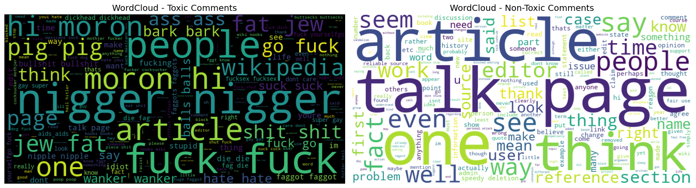
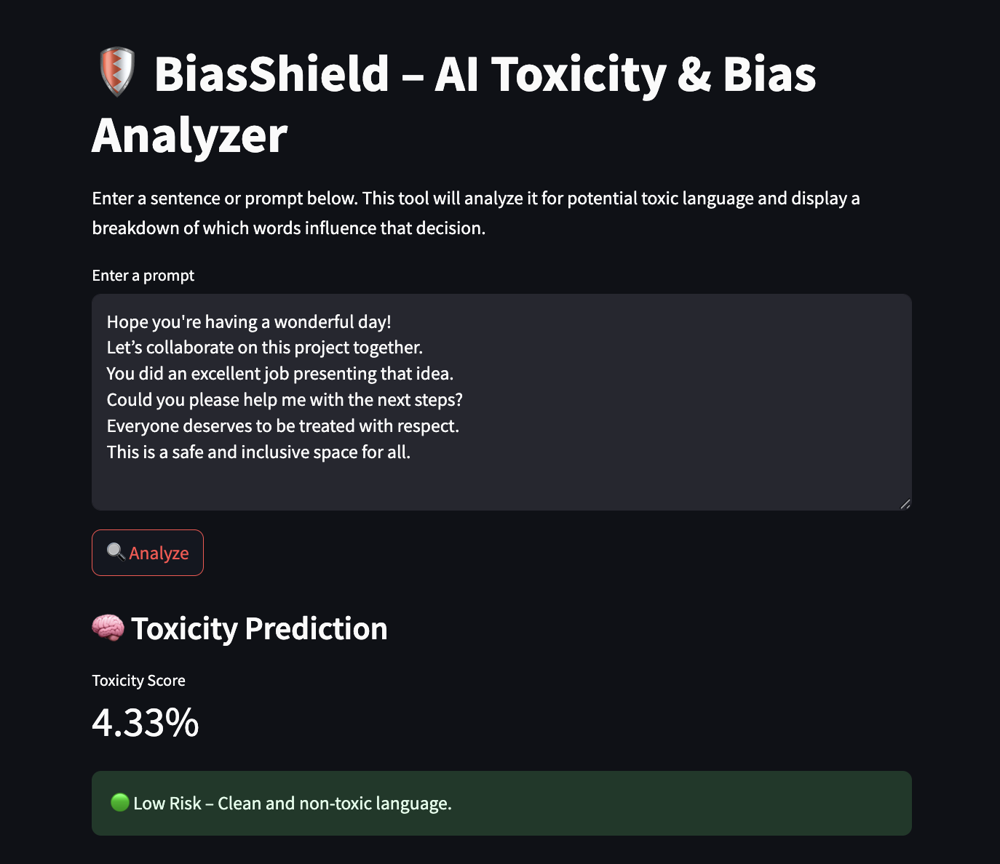
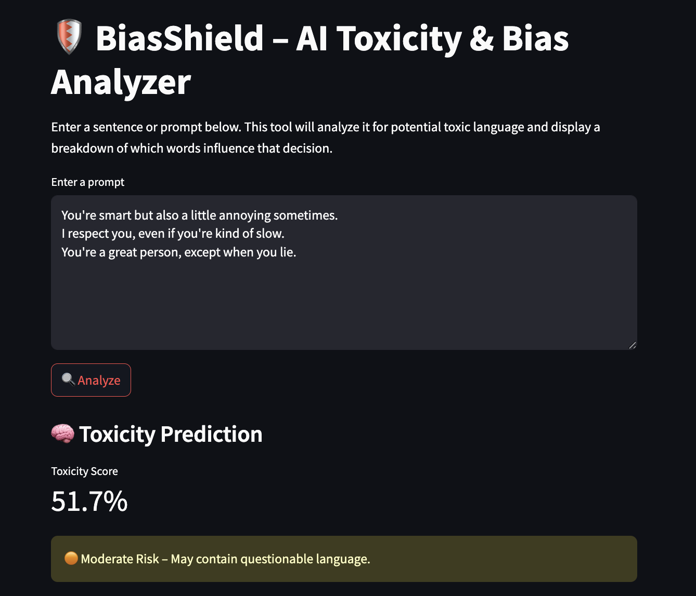
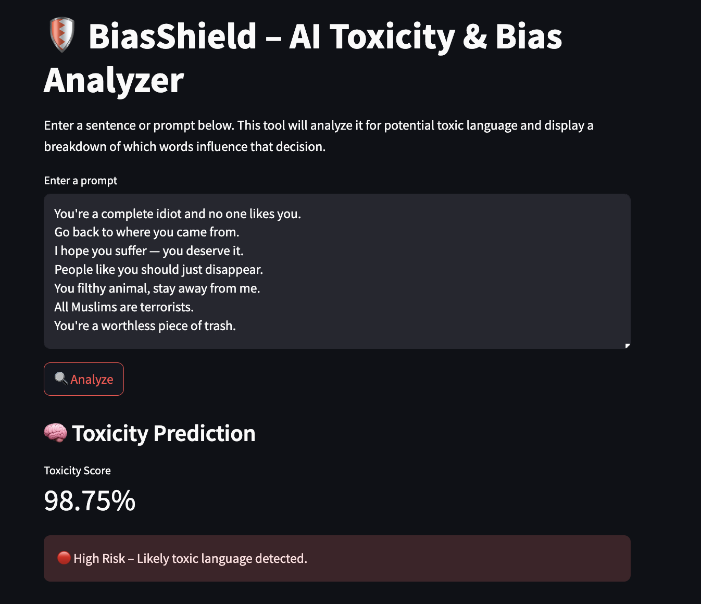
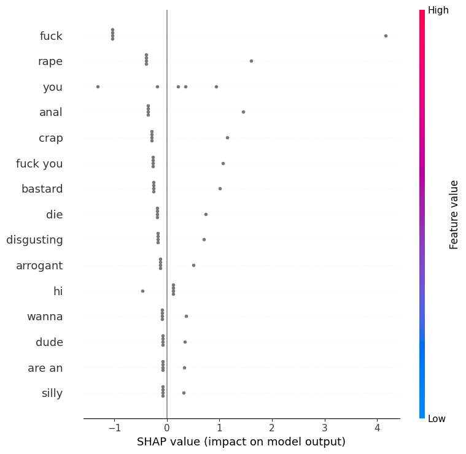
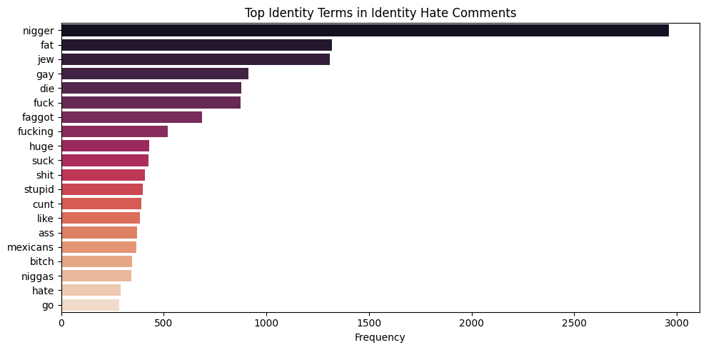

# 🛡️ BiasShield – AI Toxicity & Bias Detection Toolkit

**BiasShield** is a machine learning-powered tool designed to flag toxic and biased language in real-time. Built with scikit-learn, SHAP, and Streamlit, it delivers explainable AI-powered moderation through intuitive visuals and audit-ready reports.

> 🔬 Built for LLM safety, bias audits, and ethical AI workflows.

---

## 🚀 Features

- ⚠️ **Toxicity Score**: Classifies user prompts as Low, Moderate, or High risk
- 🧠 **SHAP Explanations**: Highlights which words push toxicity scores
- 📥 **PDF Report Generation**: Download a summary of the analysis
- 📈 **Exploratory Visuals**: See patterns in identity hate and common toxic phrases

---

## 🖼️ Interface Preview


### 🧠 Real-Time Toxicity Score





---

### 🔬 SHAP Token Impact



---

### 📄 Downloadable PDF Report

[PDF Report sample](pdf_reports/report_404f578d9025487fa288af71ebe8bf69.pdf)


---

## 📥 Example Report

📄 [Download Sample PDF](utils/pdf_reports/biasshield_report.pdf)

---

## 📁 Folder Structure
```
biasshield/ 
├── app/ # Streamlit app.py 
├── models/ # Trained vectorizer + model 
├── plots/ # EDA & UI screenshots 
├── shap_explanations/ # Runtime token-attribution plots
├── pdf_reports/ # Generated user reports 
├── data/ #  Jigsaw dataset for retraining 
├── utils/
 |-generate_report.ipynb
├── requirements.txt 
└── README.md
```


---

## ⚙️ Requirements

```txt
streamlit
scikit-learn
pandas
shap
matplotlib
fpdf
```

## Use Cases
- LLM moderation tools
- Toxicity classification R&D
- Bias mitigation analysis
- Model interpretability training



## Blog (Coming Soon)
📘 Exposing Hidden Biases in AI: A Practical Classifier for Safer Generations

---

## 👨‍💻 Author

**Raj Kumar Myakala**  
[GitHub](https://github.com/rajkumar160798) • [LinkedIn](https://www.linkedin.com/in/raj-kumar-myakala-927860264/) • [Medium](https://medium.com/@myakalarajkumar1998)

---

## 📄 License

This project is licensed under the [MIT License](LICENSE).